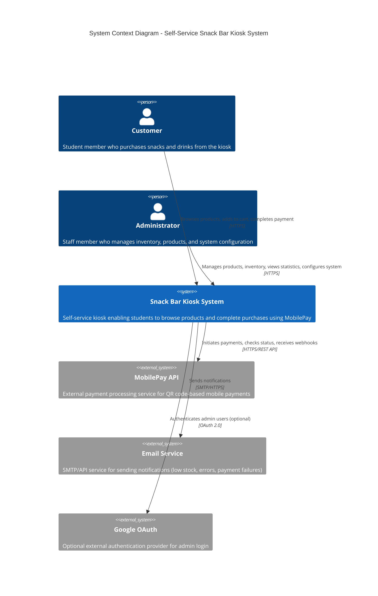
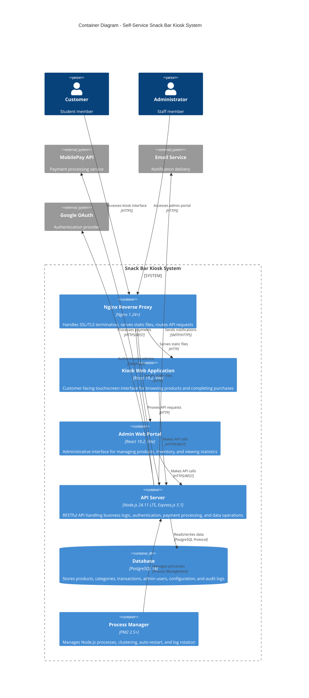
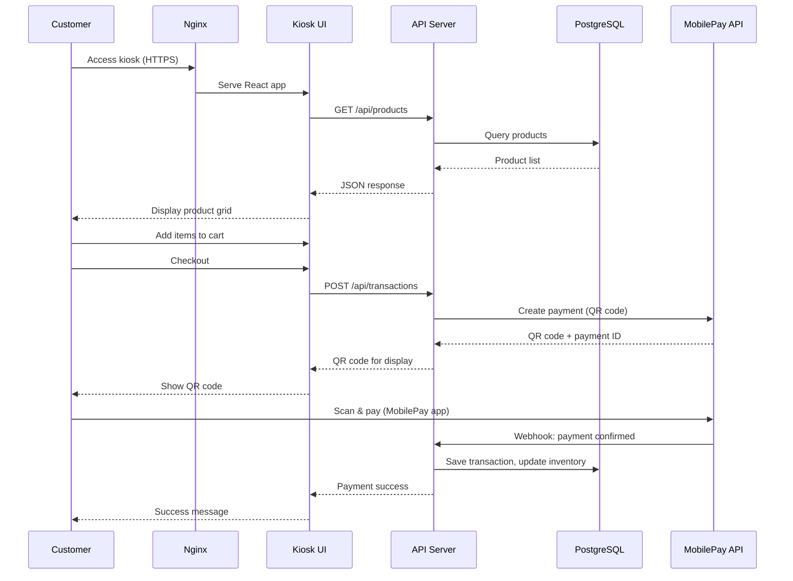
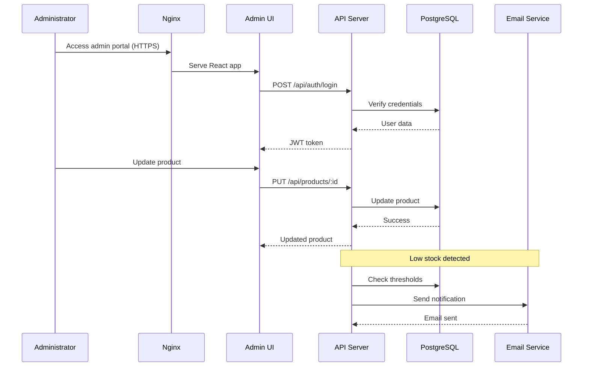
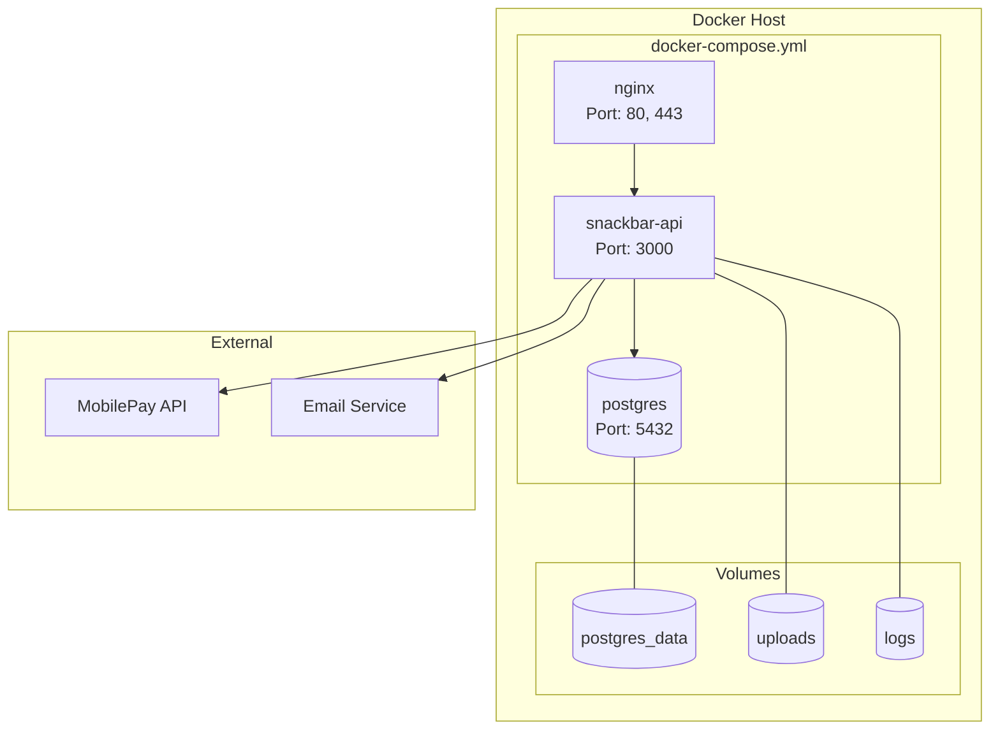
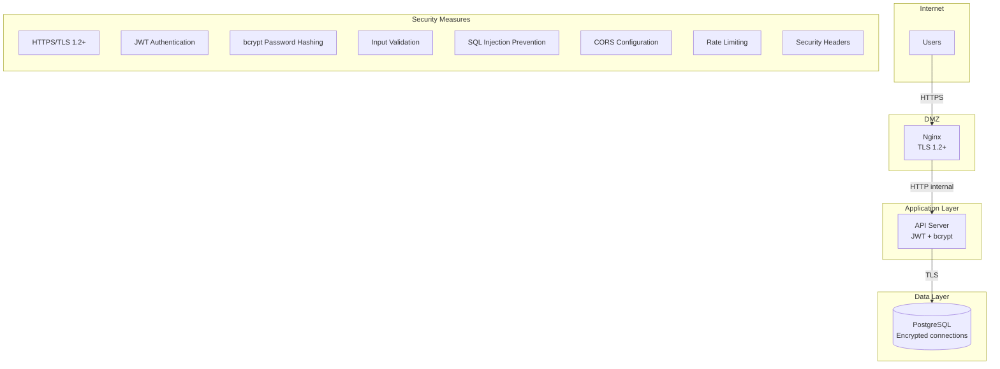
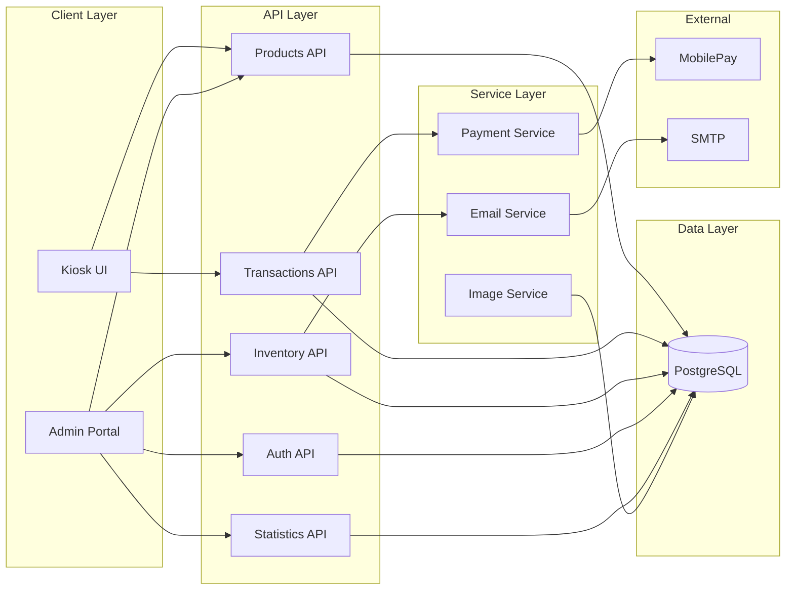

# C4 Architecture - Self-Service Snack Bar Kiosk System

**Project:** snackbar  
**Version:** 1.0  
**Date:** 2025-12-02  
**Based on:** Software Requirements Specification v1.2

---

## Overview

This document defines the high-level architecture for the Self-Service Snack Bar Kiosk System following the C4 model. The architecture is based on the PERN stack (PostgreSQL, Express.js, React, Node.js) as specified in the SRS document.

### Architecture Principles
- **Separation of Concerns:** Clear boundaries between presentation, business logic, and data layers
- **Stateless API:** RESTful API design for future multi-kiosk scalability
- **Security First:** HTTPS/TLS, secure authentication, input validation
- **Docker-Ready:** All containers configured for Docker deployment

---

## 1. System Context Diagram (C4 Level 1)

The system context diagram shows the snackbar system and its relationships with users and external systems.



### Context Diagram Description

| Element | Type | Description |
|---------|------|-------------|
| **Customer** | Person | Student member who uses the kiosk to browse and purchase snacks/drinks. No authentication required. Expected 50-100 transactions/day. |
| **Administrator** | Person | Staff member with moderate technical expertise. Manages inventory, products, views statistics. Requires authentication. |
| **Snack Bar Kiosk System** | System | The core system consisting of customer-facing kiosk and admin web portal. Handles product display, shopping cart, payments, inventory, and reporting. |
| **MobilePay API** | External System | Nordic mobile payment service by Danske Bank. Provides QR code generation, payment processing, and webhook notifications. |
| **Email Service** | External System | SMTP server or API service (SendGrid, AWS SES, Mailgun) for admin notifications including low stock alerts, system errors, and payment issues. |
| **Google OAuth** | External System | Optional authentication provider for admin login. Implements OAuth 2.0 Authorization Code flow. |

---

## 2. Container Diagram (C4 Level 2)

The container diagram shows the high-level technical containers that make up the snackbar system.



### Container Descriptions

| Container | Technology | Purpose | Port |
|-----------|------------|---------|------|
| **Nginx Reverse Proxy** | Nginx 1.24+ | SSL/TLS termination, static file serving, request routing, compression, caching | 80, 443 |
| **Kiosk Web Application** | React 19.2, Vite 5.0 | Customer-facing SPA for product browsing, cart management, and payment | Static files |
| **Admin Web Portal** | React 19.2, Vite 5.0 | Administrative SPA for product management, inventory, statistics, and configuration | Static files |
| **API Server** | Node.js 24.11 LTS, Express.js 5.1 | RESTful backend handling business logic, authentication, and integrations | 3000 |
| **Database** | PostgreSQL 18 | Persistent storage for all application data | 5432 |
| **Process Manager** | PM2 2.5+ | Node.js process management with clustering and auto-restart | N/A |

---

## 3. Container Interactions

### 3.1 Customer Purchase Flow



### 3.2 Admin Management Flow



---

## 4. Docker Deployment Configuration

All containers are configured for Docker deployment with the following structure:

### 4.1 Docker Architecture



### 4.2 Docker Compose Configuration

```yaml
version: '3.8'

services:
  # PostgreSQL Database
  postgres:
    image: postgres:18
    container_name: snackbar-db
    restart: unless-stopped
    environment:
      POSTGRES_DB: ${DB_NAME:-snackbar_prod}
      POSTGRES_USER: ${DB_USER:-snackbar_app}
      POSTGRES_PASSWORD: ${DB_PASSWORD}
    volumes:
      - postgres_data:/var/lib/postgresql/data
      - ./init-db:/docker-entrypoint-initdb.d
    ports:
      - "5432:5432"
    healthcheck:
      test: ["CMD-SHELL", "pg_isready -U ${DB_USER:-snackbar_app} -d ${DB_NAME:-snackbar_prod}"]
      interval: 10s
      timeout: 5s
      retries: 5
    networks:
      - snackbar-network

  # Node.js API Server
  api:
    build:
      context: ./server
      dockerfile: Dockerfile
    container_name: snackbar-api
    restart: unless-stopped
    depends_on:
      postgres:
        condition: service_healthy
    environment:
      NODE_ENV: production
      PORT: 3000
      DB_HOST: postgres
      DB_PORT: 5432
      DB_NAME: ${DB_NAME:-snackbar_prod}
      DB_USER: ${DB_USER:-snackbar_app}
      DB_PASSWORD: ${DB_PASSWORD}
      DB_SSL: disable
      POOL_MIN: 2
      POOL_MAX: 10
      JWT_SECRET: ${JWT_SECRET}
      SESSION_SECRET: ${SESSION_SECRET}
      BCRYPT_ROUNDS: 12
      MOBILEPAY_API_KEY: ${MOBILEPAY_API_KEY}
      MOBILEPAY_MERCHANT_ID: ${MOBILEPAY_MERCHANT_ID}
      MOBILEPAY_WEBHOOK_SECRET: ${MOBILEPAY_WEBHOOK_SECRET}
      SMTP_HOST: ${SMTP_HOST}
      SMTP_PORT: ${SMTP_PORT:-587}
      SMTP_USER: ${SMTP_USER}
      SMTP_PASSWORD: ${SMTP_PASSWORD}
      SMTP_FROM: ${SMTP_FROM}
      ADMIN_NOTIFICATION_EMAILS: ${ADMIN_NOTIFICATION_EMAILS}
    volumes:
      - uploads:/app/uploads
      - logs:/app/logs
    ports:
      - "3000:3000"
    healthcheck:
      test: ["CMD", "curl", "-f", "http://localhost:3000/api/health"]
      interval: 30s
      timeout: 10s
      retries: 3
    networks:
      - snackbar-network

  # Nginx Reverse Proxy
  nginx:
    image: nginx:1.24-alpine
    container_name: snackbar-nginx
    restart: unless-stopped
    depends_on:
      - api
    ports:
      - "80:80"
      - "443:443"
    volumes:
      - ./nginx/nginx.conf:/etc/nginx/nginx.conf:ro
      - ./nginx/ssl:/etc/nginx/ssl:ro
      - ./client/dist:/usr/share/nginx/html:ro
      - uploads:/usr/share/nginx/uploads:ro
    networks:
      - snackbar-network

volumes:
  postgres_data:
    driver: local
  uploads:
    driver: local
  logs:
    driver: local

networks:
  snackbar-network:
    driver: bridge
```

### 4.3 API Server Dockerfile

```dockerfile
# server/Dockerfile
FROM node:24.11-alpine AS builder

WORKDIR /app

# Copy package files
COPY package*.json ./

# Install dependencies
RUN npm ci --only=production

# Copy source code
COPY . .

# Production image
FROM node:24.11-alpine

WORKDIR /app

# Install PM2 globally and curl for healthcheck
RUN npm install -g pm2 && \
    apk add --no-cache curl

# Copy from builder
COPY --from=builder /app/node_modules ./node_modules
COPY --from=builder /app .

# Create directories for uploads and logs
RUN mkdir -p uploads logs

# Set non-root user for security
RUN addgroup -g 1001 -S nodejs && \
    adduser -S nodejs -u 1001 && \
    chown -R nodejs:nodejs /app

USER nodejs

# Expose port
EXPOSE 3000

# Health check
HEALTHCHECK --interval=30s --timeout=10s --start-period=5s --retries=3 \
  CMD curl -f http://localhost:3000/api/health || exit 1

# Start with PM2
CMD ["pm2-runtime", "ecosystem.config.js"]
```

### 4.4 PM2 Ecosystem Configuration

```javascript
// server/ecosystem.config.js
module.exports = {
  apps: [{
    name: 'snackbar-api',
    script: './server.js',
    instances: 2,
    exec_mode: 'cluster',
    env: {
      NODE_ENV: 'production',
      PORT: 3000
    },
    error_file: './logs/err.log',
    out_file: './logs/out.log',
    log_date_format: 'YYYY-MM-DD HH:mm:ss Z',
    merge_logs: true,
    max_memory_restart: '1G'
  }]
};
```

### 4.5 Nginx Configuration

```nginx
# nginx/nginx.conf
events {
    worker_connections 1024;
}

http {
    include       mime.types;
    default_type  application/octet-stream;
    
    # Logging
    access_log /var/log/nginx/access.log;
    error_log /var/log/nginx/error.log;
    
    # Gzip compression
    gzip on;
    gzip_types text/plain text/css application/json application/javascript text/xml application/xml;
    gzip_min_length 1000;
    
    # Upstream API server
    upstream api_backend {
        server api:3000;
    }
    
    # HTTP redirect to HTTPS
    server {
        listen 80;
        server_name _;
        return 301 https://$host$request_uri;
    }
    
    # HTTPS server
    server {
        listen 443 ssl http2;
        server_name _;
        
        # SSL configuration
        ssl_certificate /etc/nginx/ssl/fullchain.pem;
        ssl_certificate_key /etc/nginx/ssl/privkey.pem;
        ssl_protocols TLSv1.2 TLSv1.3;
        ssl_ciphers ECDHE-ECDSA-AES128-GCM-SHA256:ECDHE-RSA-AES128-GCM-SHA256;
        ssl_prefer_server_ciphers off;
        
        # Security headers
        add_header X-Frame-Options "SAMEORIGIN" always;
        add_header X-Content-Type-Options "nosniff" always;
        add_header X-XSS-Protection "1; mode=block" always;
        add_header Referrer-Policy "strict-origin-when-cross-origin" always;
        
        # Static files (React frontend)
        location / {
            root /usr/share/nginx/html;
            try_files $uri $uri/ /index.html;
            expires 1d;
            add_header Cache-Control "public, immutable";
        }
        
        # API proxy
        location /api/ {
            proxy_pass http://api_backend;
            proxy_http_version 1.1;
            proxy_set_header Upgrade $http_upgrade;
            proxy_set_header Connection 'upgrade';
            proxy_set_header Host $host;
            proxy_set_header X-Real-IP $remote_addr;
            proxy_set_header X-Forwarded-For $proxy_add_x_forwarded_for;
            proxy_set_header X-Forwarded-Proto $scheme;
            proxy_cache_bypass $http_upgrade;
            proxy_read_timeout 60s;
            proxy_send_timeout 60s;
        }
        
        # MobilePay webhooks
        location /api/webhooks/mobilepay {
            proxy_pass http://api_backend;
            proxy_http_version 1.1;
            proxy_set_header Host $host;
            proxy_set_header X-Real-IP $remote_addr;
            proxy_set_header X-Forwarded-For $proxy_add_x_forwarded_for;
            proxy_set_header X-Forwarded-Proto $scheme;
        }
        
        # Product images
        location /uploads/ {
            alias /usr/share/nginx/uploads/;
            expires 7d;
            add_header Cache-Control "public, immutable";
        }
        
        # Health check endpoint
        location /health {
            access_log off;
            return 200 "healthy\n";
            add_header Content-Type text/plain;
        }
    }
}
```

---

## 5. Technology Stack Summary

| Layer | Technology | Version | Purpose |
|-------|------------|---------|---------|
| **Reverse Proxy** | Nginx | 1.24+ | SSL termination, static files, routing |
| **Frontend** | React | 19.2 | Customer kiosk and admin portal UI |
| **Build Tool** | Vite | 5.0 | Frontend build and development |
| **Backend** | Node.js | 24.11 LTS | JavaScript runtime |
| **Framework** | Express.js | 5.1 | RESTful API framework |
| **Database** | PostgreSQL | 18 | Primary data storage |
| **DB Client** | node-postgres (pg) | 8.11.x | Database connectivity |
| **Process Manager** | PM2 | 2.5+ | Process clustering and management |
| **Containerization** | Docker | 24.x | Deployment and orchestration |

---

## 6. Security Architecture



### Security Controls

| Control | Implementation | SRS Requirement |
|---------|----------------|-----------------|
| **Transport Security** | TLS 1.2+ via Nginx | NFR-9 |
| **Password Storage** | bcrypt (12 rounds) | NFR-8 |
| **API Authentication** | JWT tokens | FR-5.1 |
| **Session Timeout** | 30 minutes inactivity | FR-5.4 |
| **Input Validation** | express-validator | FR-6.4.1 |
| **SQL Injection** | Parameterized queries | Section 5.3.1 |
| **Image Upload Security** | Whitelist validation, EXIF stripping | FR-6.4.2, NFR-8.2 |

---

## 7. Data Flow Architecture



---

## 8. Deployment Environments

| Environment | Purpose | Infrastructure |
|-------------|---------|----------------|
| **Development** | Local development | Docker Compose, local PostgreSQL |
| **Staging** | Pre-production testing | Docker containers, staging database |
| **Production** | Live system | Docker Swarm/Kubernetes, managed PostgreSQL |

### Production Requirements (from SRS 15.1)

- **CPU:** 2 cores minimum (4 recommended)
- **RAM:** 4GB minimum
- **Storage:** 10GB database + 20GB images/backups
- **Network:** 5 Mbps minimum (10 Mbps recommended)

---

## References

- [Software Requirements Specification v1.2](../reqeng/Software_Requirements_Specification_v1.2.md)
- [User Stories](../reqeng/user_stories.md)
- [Test Cases v1.1](../reqeng/Test_Cases_v1.1.md)

---

**Document Status:** APPROVED  
**Architecture Style:** C4 Model  
**Diagram Format:** Mermaid.js  
**Deployment:** Docker-ready
